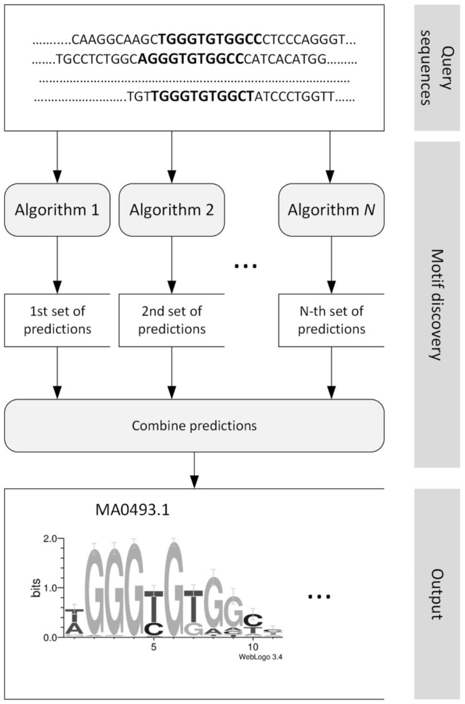

# What is motif discovery?

> "Motif analysis is useful for much more than just identifying the causal DNA-binding motif in TF ChIP-seq peaks. When the motif of the ChIPed protein is already known, motif analysis provides validation of the success of the experiment. Even when the motif is not known beforehand, identifying a centrally located motif in a large fraction of the peaks by motif analysis is indicative of a successful experiment. Motif analysis can also identify the DNA-binding motifs of other proteins that bind in complex or in conjunction with the ChIPed protein, illuminating the mechanisms of transcriptional regulation. Motif analysis is also useful with histone modification ChIP-seq because it can discover unanticipated sequence signals associated with such marks."
>
> Excerpt from Bailey T, Krajewski P, Ladunga I, Lefebvre C, Li Q, Liu T, et al. (2013) **Practical Guidelines for the Comprehensive Analysis of ChIP-seq Data.** PLoS Comput Biol 9(11): e1003326. doi:10.1371/journal.pcbi.1003326

# Ensemble methods for motif discovery

There are many many motif discovery tools out there. All utilising different algorithms and will have varying outputs. It is best to use a number of tools together and to find the top hits that can be found from those methods. 

Taken from 
[Andrei Lihu, Stefan Holban; A review of ensemble methods for de novo motif discovery in ChIP-Seq data . Brief Bioinform 2016; 17 (4): 731. doi: 10.1093/bib/bbw047](https://academic.oup.com/bib/article/17/4/731/1742437/A-review-of-ensemble-methods-for-de-novo-motif)

## HOMER

First things first, let's create a folder for HOMER to live in.

> ~~~
> cd ~
> mkdir HOMER/
> cd HOMER/
> ~~~~
{: .bash}

Now download the file and save it into HOMER/ folder.

[configureHomer.pl](http://homer.ucsd.edu/homer/configureHomer.pl)

And now we run the configureHomer.pl file

> ~~~
> perl configureHomer.pl -install
> ~~~
{: .bash}

At the end of the installation, configureHomer.pl will ask you to add a line to your .bashrc or .bash_profile file. The line will look something like this:

> ~~~
> PATH=$PATH:/path/to/HOMER/.//bin/
> ~~~
{: .source}

> ## Let's do this! 
>
> open your .bashrc or .bash_profile file using your favourite text editor
>
>Put the line in your file: 
>
> ~~~
> export PATH=$PATH:/path/to/HOMER/.//bin/
> ~~~
>{: .source}
>
> save your file
>
> ~~~
> source .bashrc
> ~~~
> {: .source}
{: .challenge}

After we've installed HOMER we can run the findMotifsGenome.pl

> ~~~
> findMotifsGenome.pl NAME_peaks.bed /path/to/hg19.fa MotifOutput/ -size 200 -mask
> ~~~
{: .bash}

And now we can look at the outputs produced by findMotifsGenome.pl by looking in our MotifOutput/ directory.

## MEME-Chip

bedtools getfasta
upload fasta file into meme-chip

# Comparison of results and top result selection: STAMP

# Some limitations of motif analysis

